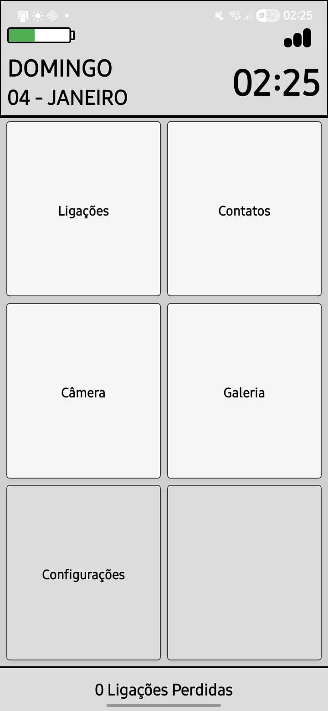

# ObaLauncher - Launcher Android Simples para Idosos




Um launcher Android customizado em **React Native** inspirado no **Obabox**, com interface simplificada para idosos, ícones grandes e navegação intuitiva.

## 🚀 Funcionalidades Implementadas

✅ **Launcher Android nativo** - vira tela inicial do celular  
✅ **Status real** - bateria e sinal de rede funcionais  
✅ **6 botões principais** - Ligações, Contatos, Câmera, Galeria, Configurações  
✅ **Contatos com índice alfabético** - SectionList + sidebar A-Z  
✅ **Favoritos persistentes** - salvos no AsyncStorage, aparecem no topo  
✅ **Gerenciar favoritos** - tela dedicada para add/remove  
✅ **Navegação com pilha** - botão voltar correto entre telas  
✅ **BackHandler otimizado** - Home fecha app, outras voltam tela anterior  


## 📦 Instalação

```bash
git clone <repo>
cd ObaLauncher
npm install
# Android
cd android && gradlew clean && cd ..
npx react-native run-android
```

## Permissões necessárias:

```bash
READ_CONTACTS
READ_PHONE_STATE
ACCESS_FINE_LOCATION
CALL_PHONE
```

# 🎯 Próximos Passos Sugeridos
## 🔜 Fácil (1-2h cada)

💭 Ícones SVG/PNG nos botões (substituir textos)

💭 Tela Galeria (Photos) - react-native-image-picker

💭 Tela Câmera - react-native-camera ou expo-camera

💭 Ligar para SOS direto (configurar números)

💭 Contador de chamadas perdidas reais (CallLog)

💭 Tema claro/escuro toggle nas configs

💭 Backup/restore favoritos via JSON

## 🚀 Médio (4-8h cada)

💭 Lista de apps instalados (PackageManager nativo)

💭 Reordenar favoritos (drag & drop)

💭 Tela de emergência com múltiplos números

💭 Suporte a tablets (responsive grid)

💭 Notificações push para chamadas perdidas

## 🎨 Visual/UX

💭 Animações suaves (Reanimated)

💭 Sons/hápticos nos botões

💭 Tamanhos de fonte configuráveis

💭 Cores customizáveis nas configs

💭 Tutorial de primeiro uso
